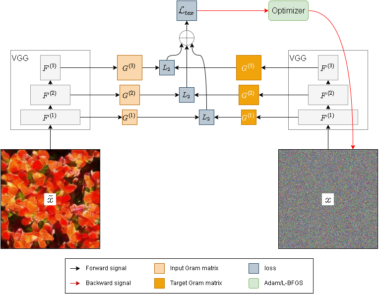

# SynTex: Synthesize Textures Using Deep Neural Networks

## Installation
### Prerequisites
This project requires the following dependencies
* python=3.6
* [tensorpack](https://github.com/tensorpack/tensorpack)=0.9.8
* tensorflow=1.12
* python bindings for opencv
### Installation
Clone this project 
```
git clone https://github.com/swift-n-brutal/syntex.git
```

Add the path that contains this project (e.g. path/to/syntex) to your `PYTHONPATH`
```
export PYTHONPATH=$PYTHONPATH:path/to
```


## Methods
### [gatys](gatys)
An optimization based method proposed by [Gatys et al.](https://arxiv.org/pdf/1505.07376v3.pdf)

### [po](po)
Fast Texture Synthesis via Pseudo Optimizer.

